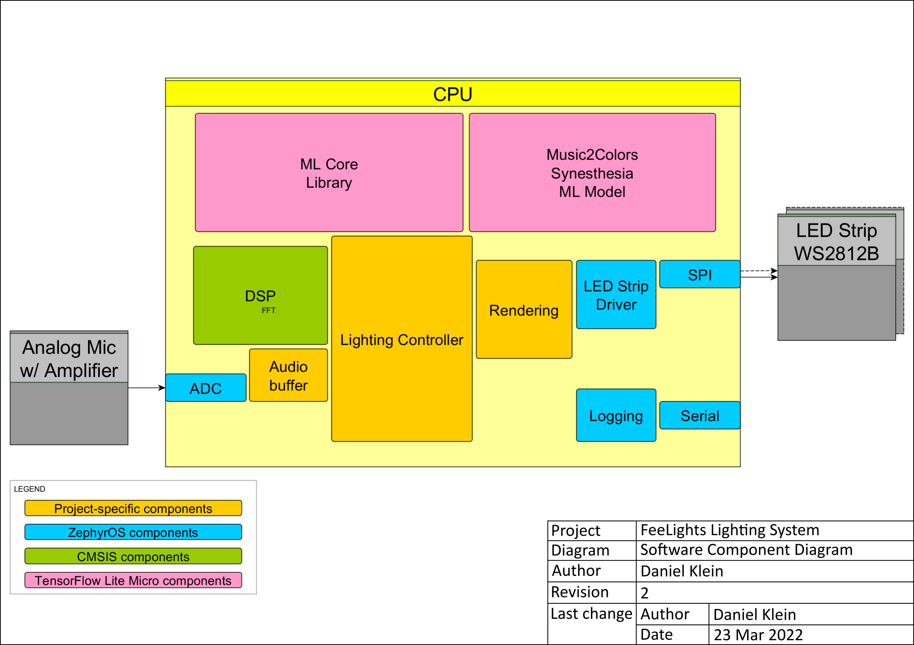
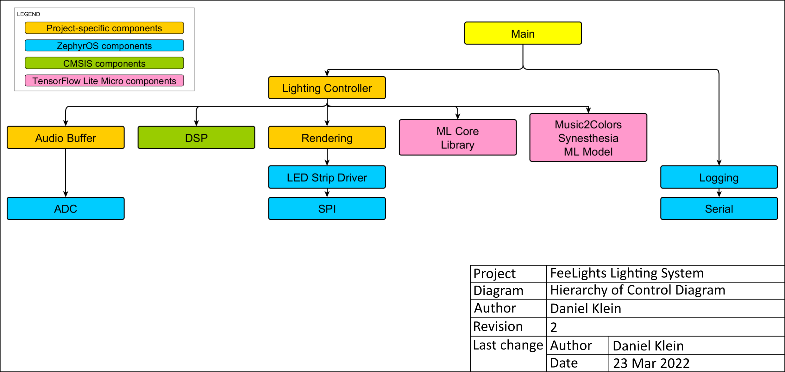

FeeLights Lighting System
=========================

A lighting system that helps dancers feel the mood
--------------------------------------------------

The goal of this system is to make a dance-room feel alive by merging music and lighting into a single, smooth experience.

The controller device uses LED strips setup around the room to light the walls and ceilings with visualisations well suited to the music being played in the room. Powered by a machine learning model, the controller is not only able to adjust to the tempo and overall energy of the song you hear, but also adjust the scene to its' emotional undertones. Using an Adaptive Gain microphone, the system will keep adjusting to the mood from the most pumped-up beginning, to the late-night, mellow end.

## Architecture

The system is designed to be autonomous and easy to setup, requiring only a power supply. Dance venues don't always come with WiFi or good cellular service, but there is usually enough power for sound and lights. Given that, power consumption of the system is not a consideration.

The heart of the system is the Lightning Controller, which takes audio input, uses the DSP and ML libraries to get all the necessary information to produce a lighting scene, which it can then output onto LED strips using the Rendering component.

